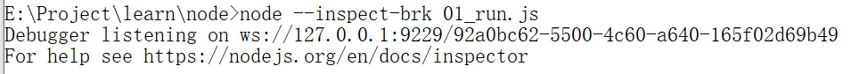

[TOC]

#### 环境

- CommonJS(nodejs模块管理规范)

- global(区别于浏览器中没有window)
- process(当前执行的进程)

#### 1.命令行执行

```
node 文件名
node --inspect-brk 01_run.js
```




#### 2.打开chrome

 [chrome://inspect/#devices](chrome://inspect/#devices) 


点击inspect

左下角{}可以进行格式化代码


实际运行的代码，被一个（）；包裹，括号内是一个函数

函数传入了四个参数：

- exports（输出，对外提供一些接口）
- require（依赖别的模块）
- module(对象，里面包含exports属性)
- _filename 文件的地址，绝对路径
- _dirname 文件所在文件夹的地址，绝对路径

#### CommonJs

- 每个文件是一个模块，有自己的作用域（一个文件内也只能有一个模块，自动包裹一个函数）
- 在模块内部，module变量代表模块本身
- module.exports属性代表模块对外接口

定义模块

1. 创建文件

2. 在模块内部定义输出module.exports

   ##### require规则

   - 通过路径加载其他的模块，/表示绝对路径，./表示相对于当前文件的路径

   - 支持js 、json、 node拓展名，不写依次尝试

   - 不写路径则认为是build-in模块或者各级node-modules内的第三方模块，从当前文件夹依次向上找直到根路径

     ```javascript
     //02_module.js
     console.log('This is a module');//打印
     const testVar = 100;
     function test(){
         console.log(testVar);
     }
     
     module.exports.testVar = testVar;
     module.exports.testFn = test;
     
     //03_require.js
     const mod = require('./02_module.js');
     console.log(mod.testVar);
     mod.testFn();
     
     ```

     加载模块时，所有语句都会被执行

   ##### require特性

   - module被加载的时候执行，加载后缓存(第一次加载并执行，第二次就会做缓存了）

   - 一旦出现某个模块被循环加载，就只输出已经执行的部分，还未执行的部分不会被输出。

```
//A
module.exports.test = 'A';
const modB = require('./05_modB');
console.log('modA:',modB.test);  

module.exports.test = 'AA';

//B
module.exports.test = 'B';

const modA = require('./05_modA')
console.log('modB:',modA.test);
module.exports.test = 'BB'; 

//MAIN
const modA = require('./05_modA');
const modB = require('./05_modB');
```


#### 引用系统内置模块/引用第三方模块

不用写路径，直接写名字就可以引用到

1. 引用系统内置模块

```
//fs是用来操作二进制流的
const fs = require('fs');

const result = fs.readFile('./06_fs.js',(err,data) =>{
    if(err){
        console.log(err);
    }else{
        console.log(data.toString());
    }
    
});
console.log(result);//undefined
```

2. 引用第三方模块

   `npm install chalk`

   

```
//查找全局的npm包
npm root -g
//C:\Users\lenovo2017lyp\AppData\Roaming\npm\node_modules
cd  ...
ls
```

- 老版本，node_moudles里面含自己的直接依赖，依赖的依赖在更下层的文件夹

类似递归，目录结构清晰一点，但是性能，资源占用比较多

- 新版本，所有的依赖都在平级的文件夹

#### module.exports 与exports的区别

```javascript
//exports是module.exports的一个快捷方式

const exports = module.exports;
// (
//     function(exports,require,module,_filename,_dirname){
//         //code
//     }
// )

//不可直接赋值，改变exports的指向
exports = {
    a:1,
    b:2,
    test:100
}
//正确的写法,模块对外的输出module.exports
module.exports = {
    a:1,
    b:2,
    test:100
}
```

#### global变量

- CommonJs
- Buffer、 process、console
- timer

> 局域变量/全局变量

#### process进程

```
/**
 * argv
 * argv0 保存了argv第一个值的引用
 * execArgv 返回调用Node所传入的特殊参数
 * execPath 调用路径
 */
const { argv,argv0,execArgv,execPath} = process;

argv.forEach( item =>{
    console.log(item);
    //可包含命令行传入的参数
})
```

控制台命令：

写在node 命令 与 文件名 之间的 不为参数

```javascript
setImmediate(()=>{
    console.log('setImmediate');
});

setTimeout(()=>{
    console.log('timeout');
},0)

process.nextTick(()=>{
    console.log('nextTick')
})
//nextTick timeout immediate
```

nextTick放在当前队列的最尾，

settimeout/setinterval

immediate放在下一个队列的最前,较优

若nextTick中套着nextTick，则会直接调用，出现后面异步事件没办法开始的样子

#### 调试

- Inspector

node --inspect-brk 14_debug.js

chrome 中调试

- VS Code

  条件调试

```
 "runtimeExecutable": "E:\\开发软件\\node.js\\node.exe"
```

